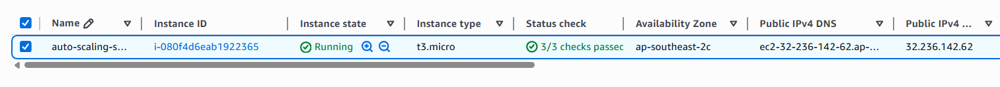
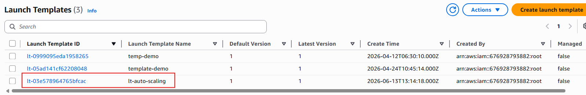
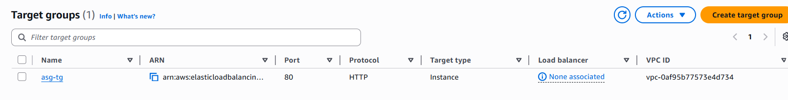
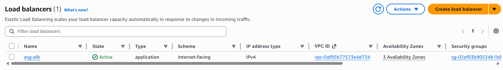
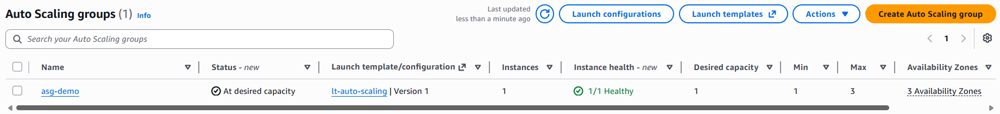
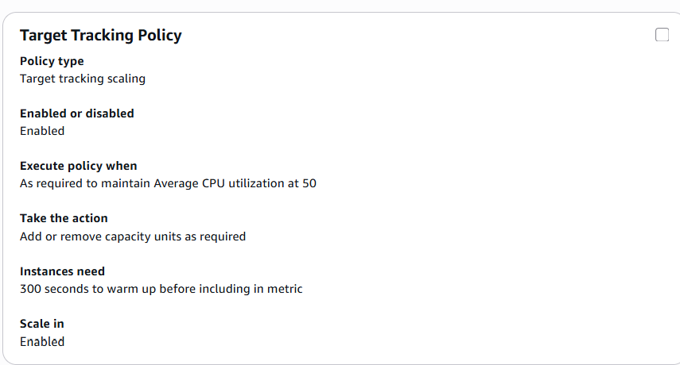
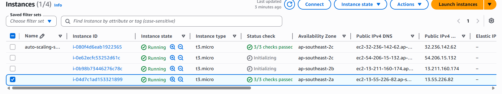

# AWS Auto Scaling Project

## Objective

Automatically scale EC2 instances based on demand using AWS Auto Scaling.

---

## Services Used

- AWS EC2
- AWS Auto Scaling
- AWS Load Balancer
- Target Group
- CloudWatch

---

## Step 1 - Launch EC2 Instance

Launch a Red Hat EC2 instance.

---

## Step 2 - Create Launch Template

Create a launch template for Auto Scaling.

---

## Step 3 - Create Target Group

Create a target group for EC2 instances.

---

## Step 4 - Create Application Load Balancer

Create an Application Load Balancer.

---

## Step 5 - Create Auto Scaling Group

Create an Auto Scaling Group.

---

## Step 6 - Configure Scaling Policy

Configure dynamic scaling policy.

---

## Step 7 - Test Auto Scaling Functionality

Increase CPU utilization and verify that Auto Scaling automatically launches additional EC2 instances based on the scaling policy.

---

# Final Result

Successfully configured AWS Auto Scaling with Application Load Balancer and verified automatic instance scaling based on CPU utilization.
